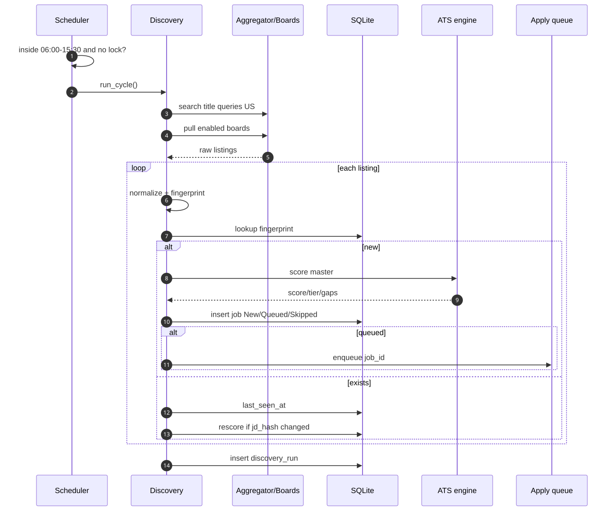
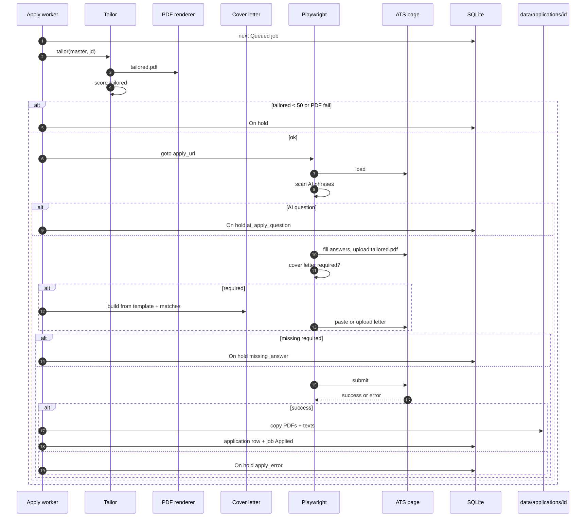

# FindOne
## Software Engineering Report and Master Development Plan

**Document type:** Software requirements, architecture, design, and phased delivery plan  
**Status:** Design only — **do not implement until you request it**  
**Product owner:** You (single user, local machine)  
**Stack (locked):** Python (FastAPI) + Playwright + React (Vite) + SQLite  
**LLM:** None (no Gemini, no ChatGPT, no cloud scoring)

This document is the single source of truth. It includes every rule we locked, every module, every data field, diagrams, edge cases, tests, operations, and build phases.

**View the diagrams:** press `Ctrl+Shift+V` (Markdown Preview). Charts such as the data model then appear as pictures, the same way they did in chat — not as code.

---

# 1. Document control

| Field | Value |
|--------|--------|
| Product name | FindOne |
| Version of this plan | 1.0 (consolidated) |
| Audience | You + future you when coding |
| Environment | Windows PC, localhost only |
| Daily window | 06:00–15:30 local time |
| Poll interval | 20 minutes |
| Application count cap | None |
| Quality floor | Tailored ATS score ≥ 50 |

---

# 2. Problem statement

You need a **personal** system that:

1. Finds **new** US jobs that match your Java / backend titles **early** (about every 20 minutes during the work window).
2. Scores each job against **your** resume **on your computer**.
3. **Rewrites layout** of your real resume (not fake skills) into a **PDF** that is stronger for ATS keyword placement.
4. Writes a **cover letter only when the form requires one**.
5. **Auto-fills and submits** on simple public apply forms (Greenhouse, Lever, Ashby).
6. **Stops** if the form asks whether the application was AI/auto submitted, and parks that job for **your review**.
7. **Never** uses LinkedIn Easy Apply.
8. Shows a dashboard like commercial auto-apply tools: Running, Applying, Applied, On hold.
9. Remembers **exactly** what was sent (PDFs, letter, answers, scores, time).

Commercial tools (Jobright, aiApply) do hunt + match + apply + inbox. **v1 of FindOne does hunt + match + tailor + apply + review queue.** Inbox / interview tracking is out of scope for v1.

---

# 3. Goals and non-goals

## 3.1 Goals (v1)

- Continuous discovery in the time window
- Local ATS score + gaps + reason
- Tailored resume PDF from **true** master content
- Required cover letter from **template + true matches**
- Auto-submit on supported ATS only
- On-hold queue for AI-apply questions, missing answers, hard sites
- Applied archive with full evidence
- 90-day company deny-list
- Chrome extension to finish On-hold forms and **learn** answers
- SQLite + files on disk; React monitor

## 3.2 Non-goals (v1)

- LinkedIn Easy Apply or LinkedIn scraping
- Indeed/Workday login scraping
- CAPTCHA solving, anti-bot bypass, credential stuffing
- Inventing resume skills or cover-letter claims
- Multi-user accounts, cloud SaaS, mobile app
- Auto-submit on arbitrary Workday / Taleo / iCIMS
- Gmail parsing / “replies reach you”
- Daily **count** ceiling (removed on purpose)
- Gemini or any paid LLM

---

# 4. Users and environment

| Actor | Role |
|--------|------|
| You | Upload resume, edit answers/template, start PC in window, review On hold, watch Applied |
| FastAPI backend | Clock, discovery, score, tailor, queue |
| Playwright worker | Browser fill/submit/stop |
| React UI | Monitor and configuration |
| Chrome extension | Assist On hold; save answers |
| External job APIs / public boards | Listing data only |
| Employer ATS pages | Forms we fill; we do not own them |

**Assumption:** Your PC is **awake** 06:00–15:30. If it sleeps, cycles are missed until the next start (one catch-up poll on startup if still inside the window).

---

# 5. Glossary

| Term | Meaning |
|------|---------|
| Master resume | Your uploaded structured resume + original PDF |
| Tailored resume | Reordered real content for **one job** |
| ATS score | Local 0–100 keyword/requirement score, not a vendor ATS |
| Strong / good / weak | ≥75 / 50–74 / <50 |
| On hold | Do **not** submit; you review |
| Applied | Submit **succeeded**; evidence stored |
| Deny-list | Companies applied to in last 90 days |
| Fingerprint | Dedup key for the same job from two sources |
| AI-apply question | Form asks if a bot/AI/third party submitted the app |
| Quality floor | Auto-apply only if tailored score ≥ 50 |
| Work window | 06:00–15:30 local |

---

# 6. Constraints and assumptions

**Constraints**

- Single user, bind `127.0.0.1` only
- No LLM budget
- Free/cheap job APIs will rate-limit; one discovery cycle at a time
- Employer sites change HTML; v1 supports **three** ATS families only
- Cover letters without an LLM will sound templated; that is accepted
- Tailoring can raise **keyword placement** score, not magic-fit a weak career mismatch

**Assumptions**

- You can provide structured resume JSON (or fill a form we map to JSON), not PDF-only
- You are authorized to work in the US and **do not need sponsorship**
- You accept uncapped volume **as long as quality floor holds**
- “Posted in this time period” means: overnight backlog at 06:00, then **new** `first_seen_at` until 15:30

---

# 7. Your domain profile (hard-coded)

## 7.1 Target titles (auto-apply family)

- Java Developer / Java Backend Developer
- Backend Software Engineer / Backend Developer
- Software Engineer I / II
- Software Developer
- Java Software Engineer
- Spring Boot Developer
- Microservices Developer
- API Developer / REST API Developer
- Application Developer
- Software Development Engineer (SDE I)

**Title policy:** If the job title (after synonym map) is **not** in this family, **cap score at 49** → cannot auto-apply (Staff/Principal/Director/intern/mobile/data-science-only, etc.).

## 7.2 Location and work mode

- Anywhere in the **United States**
- Remote, hybrid, on-site: **all allowed**
- Drop: clearly another country and **not** US-remote

## 7.3 Sponsorship

- `needs_sponsorship = false`
- Keep jobs that say no sponsorship / must be authorized / say nothing
- Jobs that **offer** sponsorship may still be applied to (you still qualify)
- Optional later hard-no: clearance / citizenship-only if you add phrases

## 7.4 Search skills

Java, Spring Boot, REST APIs, microservices, plus skills listed on the master resume.

---

# 8. Functional requirements

### Discovery

- **FR-D1** Poll every 20 minutes during 06:00–15:30.
- **FR-D2** Do not overlap cycles.
- **FR-D3** 06:00 cycle includes jobs posted overnight.
- **FR-D4** After 15:30, no hunt and no apply.
- **FR-D5** Query US listings using title-derived strings.
- **FR-D6** Ingest public Greenhouse, Lever, Ashby boards you enable.
- **FR-D7** Skip LinkedIn URLs.
- **FR-D8** Dedup by canonical URL then company+title+location.
- **FR-D9** New jobs get `first_seen_at` and master ATS immediately.
- **FR-D10** Re-score existing fingerprint only if JD hash changed.
- **FR-D11** Persist each cycle’s stats and per-source errors.
- **FR-D12** Manual “Run discovery now” in UI (still respects window unless a hidden force flag for debugging).

### Scoring

- **FR-S1** Score from master structured resume vs cleaned JD.
- **FR-S2** Matched = supported by resume text only.
- **FR-S3** Gaps = unsupported requirements.
- **FR-S4** Core requirements weigh more than nice-to-have.
- **FR-S5** Python assigns tier from score (ignore any external label).
- **FR-S6** Extraction failure → On hold `needs_manual`.
- **FR-S7** Weak jobs stored but never auto-applied.

### Resume and tailor

- **FR-R1** Portal upload: master PDF + structured JSON + cover template.
- **FR-R2** Derive and store master plain text.
- **FR-R3** Tailor by **reorder/select** existing skills and bullets only.
- **FR-R4** Emit tailored PDF + `.txt`.
- **FR-R5** Second ATS score on tailored text.
- **FR-R6** Auto-apply only if master ≥ 50 **and** tailored ≥ 50.
- **FR-R7** Always attach **tailored PDF** as the resume file.

### Cover letter

- **FR-C1** Create a letter **only if required**.
- **FR-C2** Template + `{company}` `{job_title}` `{matched_1..3}` etc.
- **FR-C3** No claims absent from resume.
- **FR-C4** Paste text or attach one-page PDF depending on control type.
- **FR-C5** Required but cannot generate → On hold `missing_cover_letter`.
- **FR-C6** Optional cover letter field → skip (v1).

### Apply

- **FR-A1** Playwright persistent browser profile.
- **FR-A2** v1 sites: Greenhouse, Lever, Ashby-like forms.
- **FR-A3** Fill from `learned_answer` then profile defaults.
- **FR-A4** Scan all visible questions for AI-apply phrases → On hold, **no submit**.
- **FR-A5** Missing required answer → On hold.
- **FR-A6** Unsupported site / CAPTCHA / login wall → On hold `unsupported_site`.
- **FR-A7** Success → Applied + 90-day deny-list.
- **FR-A8** No application **count** min or max.
- **FR-A9** Never LinkedIn Easy Apply.

### Applied archive

- **FR-P1** Store job identity, timestamps, both scores, gaps, tailor notes.
- **FR-P2** Store copies of master PDF, tailored PDF, tailored text.
- **FR-P3** Store cover letter text/PDF flags and inserted match points.
- **FR-P4** Store answers JSON and confirmation code if present.

### UI and extension

- **FR-U1** Home: running state, last run, counts.
- **FR-U2** Pages: New, Applying, Applied, Applied detail, On hold, Skipped, Resume, Answers, Sources.
- **FR-U3** Extension fills On hold; **user** clicks Submit.
- **FR-U4** Extension upserts answers.
- **FR-U5** Manual “I submitted” to keep deny-list honest.

---

# 9. Non-functional requirements

| ID | Requirement |
|----|----------------|
| NFR-1 | Backend bound to localhost |
| NFR-2 | Mutating APIs require `X-FindOne-Key` |
| NFR-3 | Secrets in `.env`, never git |
| NFR-4 | Discovery cycle target < 15 minutes typical so 20-min spacing is safe |
| NFR-5 | ATS + tailor for one job: seconds, not minutes |
| NFR-6 | Playwright one job at a time (no 5 parallel browsers in v1) |
| NFR-7 | SQLite WAL mode; backup `data/` folder |
| NFR-8 | Logs: cycle id, job id, action, result; no passwords |
| NFR-9 | UI usable at 1280px; simple English labels |
| NFR-10 | Crash of Playwright must not crash FastAPI; job → On hold `apply_error` |
| NFR-11 | Idempotent apply: never double-submit same `job_id` |
| NFR-12 | Resume PDFs stored even if DB row exists (files are source of proof) |

---

# 10. System context




You never send resume/JD to a generative AI API.

---

# 11. Container view (C4)




---

# 12. Component design (backend)




**Responsibility list**

| Module | Does | Does not |
|--------|------|----------|
| `discovery/` | Fetch, normalize, dedup, skip LinkedIn | Score quality beyond calling ATS |
| `scoring/` | Clean JD, extract reqs, score, tier | Call the web |
| `tailor/` | Reorder real content, PDFs, letters | Invent facts |
| `apply/` | Browser, detect, fill, submit/stop | Discovery |
| `scheduler.py` | Window + interval + overlap lock | Business rules |
| `api/` | HTTP, validation, auth header | HTML scraping |

---

# 13. Job lifecycle (state machine)




**Statuses:** `New`, `Queued`, `Tailoring`, `Applying`, `Applied`, `On hold`, `Skipped`.

**`hold_reason`:**  
`ai_apply_question` | `missing_answer` | `missing_cover_letter` | `unsupported_site` | `pdf_failed` | `linkedin` | `weak` | `denied` | `needs_manual` | `apply_error` | `not_us` | `title_cap`

---

# 14. Decision tree: skip vs hold vs submit




---

# 15. Sequence: one 20-minute discovery cycle




---

# 16. Sequence: apply one job




---

# 17. Scheduler logic




**Apply continues inside the window** after a cycle, one job at a time, until queue empty or 15:30. At 15:30: finish the **current** Playwright job only (do not start a new one). Overnight queue does not apply.

**Startup:** if now in window, run one discovery immediately, then interval.

---

# 18. Data model (ER)




---

# 19. Physical files (proof of apply)

```
data/
  findone.db
  resumes/master.pdf
  applications/{application_id}/
    master.pdf
    tailored.pdf
    tailored.txt
    cover_letter.txt
    cover_letter.pdf          # if file
    answers.json              # optional duplicate of DB
    screenshot.png            # optional
```

SQLite stores **paths**, scores, and text. Files are not deleted when UI filters change.

---

# 20. ATS algorithm (exact rules)

**Clean JD**

- Lowercase copy for matching; keep original for UI
- Cut from headings: Benefits, Perks, About us, About the company, Equal opportunity, EEO, Diversity, Accommodations (configurable list)
- Cap cleaned length (e.g. 8,000 characters)

**Extract requirements**

- Prefer lines under: Requirements, Qualifications, What you’ll need, Must have, What we’re looking for, Minimum qualifications
- Nice-to-have headings: Preferred, Nice to have, Bonus, Plus
- If no headings: first N non-empty bullet/sentence lines (N configurable, default 25)
- Skip lines < 20 chars or that are only “Requirements:”

**Evidence bag from resume**

- All `skills[]`
- Role titles + company names
- Tokens from bullets (stopwords removed)
- Education and certs
- Apply `synonyms.yml`

**Match a requirement line**

- Tokenize, drop stopwords, apply synonyms
- Matched if **enough** remaining tokens hit evidence (v1: ≥ 50% of content tokens **or** all proper-noun tech tokens like `spring`, `java`, `kafka`)
- If uncertain → **gap** (honesty: prefer gap)

**Score**

- Core weight 2.0, nice-to-have 0.7 (config)
- `score = round(100 * sum(weights matched) / sum(all weights))`
- Clamp 0–100
- Empty denom → needs_manual

**Tier**

- ≥ 75 strong, 50–74 good, else weak — **in Python only**

**Title cap:** if title not in family, `min(score, 49)` before tier.

**Reason template**  
`"{m} of {n} requirements matched ({cm}/{cn} core). Gaps: {top 3 gaps}."`

---

# 21. Tailor algorithm

1. Parse JD keywords from extracted requirements.
2. Split master skills into **hit** vs **rest**; output skills = hit + rest (hit first).
3. For each role, score each bullet by overlap with JD tokens; sort desc; keep all bullets in v1 but ordered (or drop bullets with 0 overlap if more than K bullets — config `max_bullets_per_role` default 6, **never drop all**).
4. Summary (optional): concatenate up to 2 existing high-overlap bullets, truncated, **not** rewritten by a model.
5. Render HTML template → PDF (WeasyPrint or ReportLab; pick one in Phase 4 and stick to it).
6. Flatten tailored JSON to text (same flattener as master).
7. ATS(tailored_text, jd).
8. Persist tailor_notes: `{skills_promoted: [], bullets_reordered: []}`.

**Forbidden:** adding “Kafka” because the JD asked and it is not on the master.

---

# 22. Cover letter algorithm

**Required detection**

- Control label/name/id/aria matches cover-letter phrases
- HTML `required` or visible asterisk
- After a failed submit, if error text mentions cover letter → generate, retry **once**, then hold

**Generate**

Master template example (you edit in UI):

```
Dear {company} Hiring Team,

I am applying for the {job_title} role. I work as {current_title}.

My background includes {matched_1}; {matched_2}; and {matched_3}.

I am authorized to work in the United States and do not require sponsorship.

Sincerely,
{your_name}
```

- `{matched_n}` = first n **matched_requirements** or bullet fragments, shortened to one clause each
- If fewer than 2 matches → On hold `missing_cover_letter`
- Word count 250–400 target; hard cap 500
- Textarea → paste; `input[type=file]` → PDF on same letterhead style as resume

**Optional field:** do not generate (v1).

---

# 23. AI-apply detection

Load `ai_apply_phrases.yml`. For every label, legend, span near inputs, question text:

Normalize (lowercase, strip punctuation) and substring/phrase match examples:

- did you use ai to apply
- used ai to complete this application
- automated application
- generative ai / chatgpt / copilot to apply
- submitted by a bot
- third-party tool or service apply
- was this application completed by software

If hit → **immediate stop**, no submit, `hold_reason=ai_apply_question`, save snippet of question text on the job row for the On hold UI.

You add new phrases when you see new wording. No model.

---

# 24. Field filling and learned answers

**`question_key`:** label / aria-label / placeholder / name / id → lowercase, strip punctuation, collapse spaces.

**Fill order**

1. Exact `learned_answer.question_key`
2. `question_aliases.yml`
3. Profile: first name, last name, email, phone, city, LinkedIn URL, GitHub, work authorized = yes, sponsorship required = no
4. Resume file = tailored PDF (not learned)
5. Else leave empty; if required → hold

**Widget types**

- text/textarea: set value
- select: option whose visible text fuzzy-equals answer
- checkbox/radio: yes/no synonyms (yes, true, authorized)
- file: only resume/letter paths we generated

**Learning (extension + optional Playwright after you correct — v1 extension only)**  
Upsert answer, `hit_count++`.

Never auto-fill a **new** salary number. If required salary empty → On hold.

---

# 25. Dedup and deny-list

**Fingerprint**

1. Canonical URL: lowercase host, strip `www.`, strip query keys `utm_*`, `gh_src`, `lever-source`, fragment
2. Else `norm(company) + "|" + norm(title) + "|" + norm(location)`
3. `norm`: lowercase, remove `, Inc.` `LLC` `Ltd.` punctuation, collapse space

**Company deny**

- `SELECT DISTINCT company FROM application WHERE applied_at >= now-90d`
- Compare `norm(company)` **equality**, not substring (avoid “Meta” inside “Metatron”)
- Alias map: Facebook ↔ Meta, Google ↔ Alphabet (you maintain)

---

# 26. Discovery sources (v1)

| Source | Use | Auth |
|--------|-----|------|
| Aggregator (Adzuna or JSearch-class; chosen at Phase 6 by live free tier) | Breadth US search | API key in `.env` |
| Greenhouse `boards-api.greenhouse.io/v1/boards/{token}/jobs` | Early company posts | Public |
| Lever `api.lever.co/v0/postings/{site}` | Early company posts | Public |
| Ashby public postings | Early company posts | Public |

**Query set (examples)**  
`"Java Developer"`, `"Java Backend"`, `"Spring Boot"`, `"Backend Software Engineer"`, `"Java Software Engineer"`, `"REST API Developer"`  
Params: country/location US. Do **not** send remote-only.

**LinkedIn:** if `apply_url` host contains `linkedin.com` → Skipped, never enqueue.

**Politeness:** one in-flight cycle; backoff a source on 429 until next cycle; record `last_error`.

---

# 27. Repository structure (complete)

```
findone/
├── README.md
├── .gitignore
├── .env.example
├── backend/
│   ├── pyproject.toml
│   ├── app/main.py
│   ├── app/config.py
│   ├── app/db.py
│   ├── app/models.py
│   ├── app/schemas.py
│   ├── app/scheduler.py
│   ├── app/profile/profile.yml
│   ├── app/profile/synonyms.yml
│   ├── app/profile/question_aliases.yml
│   ├── app/profile/ai_apply_phrases.yml
│   ├── app/profile/company_aliases.yml
│   ├── app/api/*.py
│   ├── app/discovery/service.py
│   ├── app/discovery/normalize.py
│   ├── app/discovery/dedup.py
│   ├── app/discovery/sources/aggregator.py
│   ├── app/discovery/sources/greenhouse.py
│   ├── app/discovery/sources/lever.py
│   ├── app/discovery/sources/ashby.py
│   ├── app/scoring/ats.py
│   ├── app/scoring/jd_clean.py
│   ├── app/scoring/requirements.py
│   ├── app/tailor/resume.py
│   ├── app/tailor/pdf.py
│   ├── app/tailor/cover_letter.py
│   ├── app/apply/worker.py
│   ├── app/apply/detect.py
│   ├── app/apply/fill.py
│   ├── app/apply/playwright_runner.py
│   └── tests/ + fixtures/
├── frontend/          # Vite React pages listed in §28
├── extension/         # MV3
├── data/              # gitignored, runtime
└── sample-data/
```

---

# 28. UI specification

**Home**

- Banner: Running (green) if in window and API up, else Stopped
- Last discovery time, jobs_new, errors
- Today: Applied count, On hold count, Skipped count, Queue length
- Next poll time
- Buttons: Run discovery (if in window), Pause apply (stops starting new Playwright jobs)

**New** — `first_seen_at` desc; score_master; source; status

**Applying** — current URL, company, step (tailor / fill / detect / submit)

**Applied** — table: time, company, title, score_tailored, letter yes/no

**Applied detail** — all section 29 fields; download PDFs; show letter text; answers

**On hold** — reason badge, question snippet if AI, “Open apply URL”, “Mark submitted”, “Discard”

**Skipped** — reason

**Resume** — upload PDF, JSON editor or form, letter template, preview tailor+letter against a picked job (dry run, no submit)

**Answers** — CRUD

**Sources** — enable boards, paste greenhouse token / lever site, last error

Empty states: no resume uploaded (block queue), missing aggregator key (boards-only mode OK), zero new jobs.

---

# 29. Applied record (complete field list)

**Job:** company, title, location, apply_url, source, posted_date, first_seen_at, fingerprint

**When:** applied_at, discovery_run_id (nullable)

**Scores:** score_master, tier_master, score_tailored, tier_tailored, matched_requirements[], gaps[], reasoning, tailor_notes

**Resume files:** master_pdf_path, tailored_pdf_path, tailored.txt / resume_text

**Letter:** cover_letter_required, cover_letter_used, cover_letter_text, cover_letter_pdf_path, template_version, matched_points_inserted[]

**Form:** answers_json, confirmation_code, screenshot_path

**Meta:** job.status=Applied, playwright_trace path optional

On hold jobs **never** appear here until you mark submitted.

---

# 30. API catalog

| Method | Path | Notes |
|--------|------|--------|
| GET | `/api/status` | window, running, next_poll, counts |
| POST | `/api/resumes` | multipart JSON+PDF+template |
| GET | `/api/resumes/current` | |
| POST | `/api/discovery/run` | |
| GET | `/api/discovery/runs` | |
| GET/POST/PATCH | `/api/discovery/sources` | |
| GET | `/api/jobs` | query: status, tier, new, q |
| GET | `/api/jobs/{id}` | |
| POST | `/api/jobs/{id}/discard` | On hold → Skipped |
| GET | `/api/applications` | |
| GET | `/api/applications/{id}` | |
| GET | `/api/applications/{id}/files/{kind}` | master\|tailored\|letter |
| POST | `/api/applications/manual` | body: job_id, notes |
| GET | `/api/holds` | |
| GET/POST/PATCH/DELETE | `/api/answers` | |
| POST | `/api/preview/tailor` | dry-run JSON+PDF bytes for UI |

Auth: `X-FindOne-Key` on POST/PATCH/DELETE. GET status may be open on localhost.

---

# 31. Config (`config.py` + YAML)

| Key | Default |
|-----|---------|
| `WORK_START` | 06:00 |
| `WORK_END` | 15:30 |
| `POLL_MINUTES` | 20 |
| `STRONG` | 75 |
| `GOOD` | 50 |
| `CORE_WEIGHT` | 2.0 |
| `NICE_WEIGHT` | 0.7 |
| `JD_CHAR_CAP` | 8000 |
| `MAX_BULLETS_PER_ROLE` | 6 |
| `PLAYWRIGHT_TIMEOUT_MS` | 45000 |
| `APPLY_CONCURRENCY` | 1 |
| `FINISH_CURRENT_AT_WINDOW_END` | true |
| Timezone | local Windows zone |

`.env`: `FINDONE_KEY`, `AGGREGATOR_API_KEY`, `DATABASE_URL=sqlite:///./data/findone.db`

---

# 32. Security and privacy

- Localhost only; firewall optional extra
- No resume uploaded to Gemini
- `.gitignore`: `.env`, `data/`, `*.pdf` of real resumes, Playwright profile dir
- Playwright user-data-dir stored under `data/browser-profile/` (cookies) — treat as secret
- Do not log full JD + full resume together at INFO; DEBUG only on disk
- Extension host permissions: localhost + greenhouse/lever/ashby domains, **not** `<all_urls>` in v1

**Legal/ToS note (design constraint):** v1 only uses public listing APIs/JSON and form fill on apply pages you could fill by hand. No LinkedIn automation. No CAPTCHA bypass. If a site blocks automation, job goes On hold.

---

# 33. Reliability and edge cases

| Case | Behavior |
|------|----------|
| PC starts at 10:12 | One discovery now, then every 20 min |
| PC starts at 16:00 | No discovery/apply |
| Cycle still running at 20-min mark | Skip |
| Duplicate enqueue | Unique job_id in queue |
| Playwright crash | On hold apply_error, worker continues next |
| Aggregator 429 | Skip source, boards still run |
| Two sources same job | One fingerprint |
| Resume JSON missing | Block queue; UI banner |
| Tailored PDF 0 bytes | On hold pdf_failed |
| Submit succeeds but no confirmation | Still Applied if URL/thank-you pattern matches configured selectors |
| Company “Meta Platforms, Inc.” vs “Meta” | company_aliases.yml |
| Job disappears mid-apply | On hold apply_error |
| You pause apply | Discovery may continue; queue waits |
| Clock DST | Use local timezone library, not UTC window |

---

# 34. Testing strategy

**Unit:** ATS fixtures (strong, good, weak, keyword trap, no-heading JD, title cap, weights). Tailor does not add skills. Cover letter skips optional. AI detector hits phrase list. Dedup URL query strip. Deny 89 vs 91 days. Scheduler outside window.

**Integration:** import fake listings → statuses. Preview tailor endpoint returns PDF magic bytes.

**Playwright:** recorded Greenhouse fixture HTML or public test board; assert file input received; assert submit **not** called when AI phrase present.

**Manual (before unattended window):** 5–10 real JDs scored in UI; 1 tailor preview; 1 On hold AI fake page; 1 real apply **you watch**.

**Do not** unattended-apply on day one of Phase 8.

---

# 35. Operations

- Start: `backend` uvicorn + `frontend` vite; optional Windows Task Scheduler at 05:55
- Keep PC awake in window
- Backup: copy `data/` weekly
- Logs: `data/logs/findone.log` rotating
- Health: Home red if API down (extension too)

---

# 36. Risks and mitigations

| Risk | Impact | Mitigation |
|------|--------|------------|
| ATS too dumb vs humans | Bad applies | Title cap + quality 50 + synonym growth from On hold |
| Templated cover letters | Recruiter ignore | Short, fact-only; optional field skipped |
| Site HTML changes | Worker fails | On hold; selectors per ATS family, versioned |
| Account/IP flagged | Applies blocked | Slow (1 browser), supported ATS only, no LinkedIn |
| Uncapped volume | Spam reputation | Pause button; you may add a soft cap later without changing v1 rules |
| API quota | Miss earlies | Boards-first; fewer queries |
| PDF ugly | Rejected files | One professional template; you preview |
| Sleeping PC | Miss window | Task Scheduler + sleep settings |

---

# 37. Development phases (work breakdown)

Each phase has **entry**, **work**, **exit (done when)**. No phase starts until previous exit is met. **No coding until you say start.**

### Phase 0 — Project skeleton

**Work:** repo, gitignore, FastAPI hello, Vite hello, SQLite connect, `profile.yml`, `/api/status` returns clock config.  
**Done:** browser shows API status JSON; DB file created.

### Phase 1 — Resume store

**Work:** POST resume JSON+PDF+template; flatten text; GET current.  
**Done:** round-trip file on disk + row in `resume`.

### Phase 2 — ATS

**Work:** jd_clean, extract, match, score, tier, tests with 8–10 fixture JDs.  
**Done:** unit tests green; keyword-trap is not strong.

### Phase 3 — Job table + import

**Work:** models for job; optional JSON import (useful without APIs); list/filter API.  
**Done:** jobs in DB with master scores.

### Phase 4 — Tailor + PDF

**Work:** reorder algorithm, PDF template, second score, preview API.  
**Done:** test proves no invented skill; PDF opens in reader.

### Phase 5 — Cover letter

**Work:** required vs optional flags in tests; template fill; PDF; hold if <2 matches.  
**Done:** unit tests for required/optional/fail.

### Phase 6 — Discovery

**Work:** aggregator client, GH/Lever/Ashby, scheduler 20 min + window, dedup, LinkedIn skip, discovery_run.  
**Done:** a 20-min cycle inserts **new** jobs; second cycle does not duplicate.

### Phase 7 — React monitor

**Work:** all pages with real APIs; Home banner; Applied detail downloads; On hold reasons.  
**Done:** you can operate without touching SQLite.

### Phase 8 — Playwright worker

**Work:** queue, fill, file attach, AI scan, letter, submit/hold, idempotency, window stop.  
**Done:** fixture test: AI phrase → no submit; happy path on one supported ATS **supervised**.

### Phase 9 — Extension

**Work:** fill, save answers, mark submitted.  
**Done:** On hold Greenhouse page round-trip.

### Phase 10 — Hardening

**Work:** company aliases, logging, backups doc, pause button, Playwright traces on failure, rate-limit handling.  
**Done:** one full **supervised** 06:00–15:30 day, then optional unattended.

**Suggested calendar (personal, not a contract):** Phases 0–2 (few days), 3–5 (few days), 6–7 (few days), 8–9 (longest), 10 (after first real week).

---

# 38. Phase 8 detailed sub-steps (highest risk)

1. Detect ATS family from URL/DOM
2. Map resume file input
3. Map standard fields (name, email, phone, LinkedIn)
4. AI phrase scan **before** submit
5. Cover letter control detect
6. Submit button detect
7. Success signals (thank you URL, “application submitted”)
8. Failure → hold + screenshot
9. Copy files to `data/applications/{id}` **after** success only (keep temp tailor dir for holds too, for debugging)

---

# 39. Out of scope vs later (v2+)

- Workday adapters per company
- Inbox / interview invite parsing
- Soft daily cap toggle
- Local embeddings for paraphrase match
- Postgres
- Cloud deploy
- Auto-submit On hold after you answer the AI question once globally

---

# 40. Locked decisions checklist

1. Python + Playwright + React + SQLite
2. No LLM
3. No LinkedIn Easy Apply
4. 06:00–15:30, every 20 minutes
5. No count min/max; tailored score ≥ 50
6. Title family + US + no-sponsor-needed
7. Tailor real content → attach PDF
8. Cover letter **only if required**
9. AI-apply question → On hold, never submit
10. Applied stores both scores, both resume PDFs, letter, answers, times
11. Extension does not auto-submit On hold
12. This document is the plan; **implementation starts only when requested**

---

# 41. How to use this report

When you ask to build, implement **Phase 0 → 1 → 2** first (skeleton, resume, ATS). Do not start Playwright until Phase 7 UI can show scores. Do not leave it unattended until Phase 10.

This is the full software engineering plan: requirements, architecture, every diagram, data, algorithms, UI, APIs, risks, tests, operations, and development phases.
